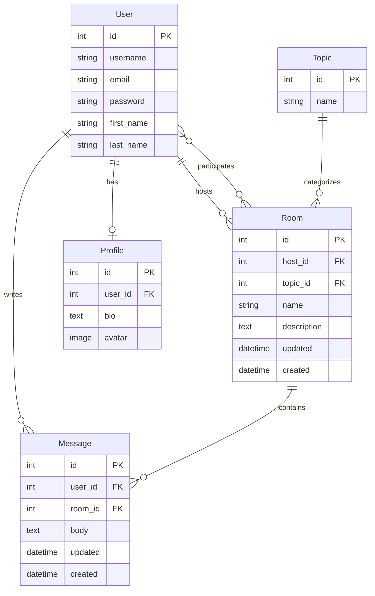
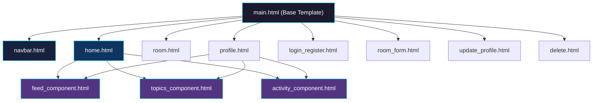
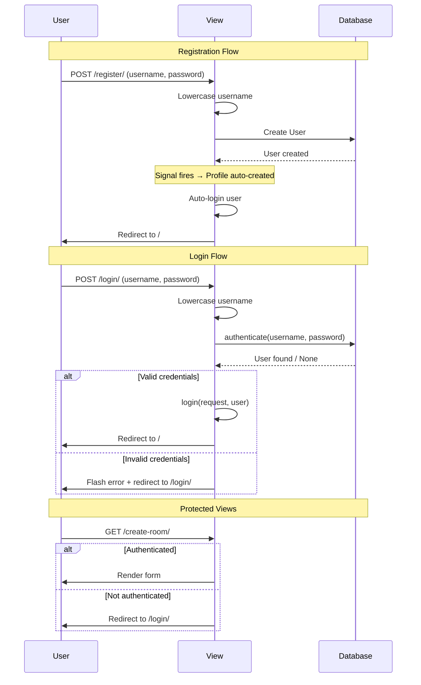
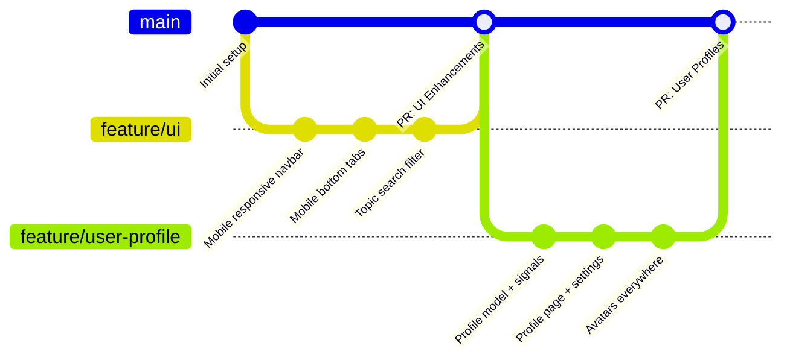

# 🚀 StudyBud — Collaborative Study Platform

> A full-featured, real-time collaborative study platform built with **Django** where users can create and join study rooms, discuss topics, and connect with fellow learners.

---

## 📑 Table of Contents

- [Overview](#-overview)
- [Features](#-features)
- [Tech Stack](#-tech-stack)
- [Project Structure](#-project-structure)
- [Database Schema](#-database-schema)
- [URL Routing](#-url-routing)
- [Views (Controllers)](#-views-controllers)
- [Models (Database)](#-models-database)
- [Forms](#-forms)
- [Signals](#-signals)
- [Templates (Frontend)](#-templates-frontend)
- [CSS Design System](#-css-design-system)
- [Authentication System](#-authentication-system)
- [Mobile Responsiveness](#-mobile-responsiveness)
- [User Profile System](#-user-profile-system)
- [Setup & Installation](#-setup--installation)
- [Environment Configuration](#-environment-configuration)
- [Git Workflow](#-git-workflow)
- [Future Improvements](#-future-improvements)

---

## 🌐 Overview

**StudyBud** is a Django-based web application that enables students and learners to:

- Create study rooms organized by topics (Python, JavaScript, Django, etc.)
- Have real-time discussions within rooms via messages
- Browse and filter rooms/topics
- View each other's profiles with avatars and bios
- Stay updated via a recent activity feed

The application follows the **MVT (Model-View-Template)** architecture pattern used by Django.

---

## ✨ Features

### Core Features

| Feature               | Description                                          |
| --------------------- | ---------------------------------------------------- |
| 🏠 **Home Feed**      | Browse all study rooms with search & topic filtering |
| 💬 **Study Rooms**    | Create, edit, delete rooms with real-time chat       |
| 📂 **Topics**         | Filter rooms by programming topics with search       |
| 📡 **Activity Feed**  | See recent messages across all rooms                 |
| 👤 **User Profiles**  | View/edit profiles with avatar uploads and bios      |
| 🔐 **Authentication** | Register, login, logout with session management      |

### UI Features

| Feature                   | Description                                     |
| ------------------------- | ----------------------------------------------- |
| 📱 **Mobile Responsive**  | Hamburger menu, bottom tab bar, stacked layouts |
| 🎨 **Dark Theme**         | Premium dark UI with gradient accents           |
| ⚡ **Client-side Search** | Instant topic filtering without page reload     |
| 🔽 **Dropdown Menus**     | Room actions with edit/delete options           |
| 📜 **Load More**          | Progressive loading for activity feed items     |

---

## 🛠 Tech Stack

| Layer                | Technology                           |
| -------------------- | ------------------------------------ |
| **Backend**          | Python 3.10+, Django 5.2             |
| **Database**         | PostgreSQL                           |
| **Frontend**         | HTML5, CSS3, Vanilla JavaScript      |
| **Templates**        | Django Template Engine               |
| **Image Processing** | Pillow (PIL)                         |
| **Media Storage**    | Local filesystem (`/media/avatars/`) |
| **Static Files**     | CSS served from `/static/styles/`    |

---

## 📁 Project Structure

```
studyBud/
├── manage.py                    # Django management script
├── db.sqlite3                   # SQLite database (development)
│
├── studypro/                    # Project configuration
│   ├── __init__.py
│   ├── settings.py              # Django settings (DB, static, media, apps)
│   ├── urls.py                  # Root URL configuration
│   ├── wsgi.py                  # WSGI entry point
│   └── asgi.py                  # ASGI entry point
│
├── base/                        # Main application
│   ├── models.py                # Database models (Topic, Room, Message, Profile)
│   ├── views.py                 # View functions (13 views)
│   ├── urls.py                  # App-level URL routing (10 routes)
│   ├── forms.py                 # Django forms (RoomForm, UserForm, ProfileForm)
│   ├── signals.py               # Auto-create Profile on user registration
│   ├── apps.py                  # App configuration with signal registration
│   ├── admin.py                 # Admin panel registrations
│   ├── migrations/              # Database migration files
│   └── templates/base/          # App-specific templates
│       ├── home.html            # Home page with room feed + mobile tabs
│       ├── room.html            # Individual room with chat + participants
│       ├── room_form.html       # Create/edit room form
│       ├── profile.html         # User profile page
│       ├── update_profile.html  # Edit profile settings
│       ├── login_register.html  # Login and registration forms
│       ├── delete.html          # Confirmation dialog for deletions
│       ├── feed_component.html  # Room card list (reusable)
│       ├── activity_component.html  # Activity feed (reusable)
│       └── topics_component.html    # Topics sidebar with search (reusable)
│
├── templates/                   # Project-level templates
│   ├── main.html                # Base template (HTML head, navbar, scripts)
│   └── navbar.html              # Navigation bar + mobile drawer
│
├── static/                      # Static assets
│   └── styles/
│       └── main.css             # Complete CSS design system (~1950 lines)
│
├── media/                       # User-uploaded files
│   └── avatars/                 # Profile avatar images
│
└── venv/                        # Python virtual environment
```

---

## 🗄 Database Schema

The application uses **4 custom models** plus Django's built-in `User` model.



---

## 🗂 Models (Database)

### Topic

```python
class Topic(models.Model):
    name = models.CharField(max_length=200)
```

- Represents a study category (e.g., "Python", "Django Framework", "TypeScript")
- Referenced by `Room` via ForeignKey
- Used for filtering rooms on the home page

### Room

```python
class Room(models.Model):
    host         = models.ForeignKey(User, on_delete=models.SET_NULL, null=True)
    topic        = models.ForeignKey(Topic, on_delete=models.SET_NULL, null=True)
    name         = models.CharField(max_length=200)
    description  = models.TextField(null=True, blank=True)
    participants = models.ManyToManyField(User, related_name='participants', blank=True)
    updated      = models.DateTimeField(auto_now=True)
    created      = models.DateTimeField(auto_now_add=True)

    class Meta:
        ordering = ['-updated', '-created']
```

- The core entity — each room is a discussion space
- **`host`**: The user who created the room. `SET_NULL` means if the user is deleted, the room persists (host shows as "@deleted")
- **`topic`**: Category tag. `SET_NULL` means rooms can exist without a topic
- **`participants`**: Many-to-many — tracks which users have chatted in the room
- **`ordering`**: Most recently active rooms appear first (by update time, then creation time)

### Message

```python
class Message(models.Model):
    user    = models.ForeignKey(User, on_delete=models.CASCADE)
    room    = models.ForeignKey(Room, on_delete=models.CASCADE)
    body    = models.TextField()
    updated = models.DateTimeField(auto_now=True)
    created = models.DateTimeField(auto_now_add=True)

    class Meta:
        ordering = ['-updated', '-created']
```

- Represents a chat message within a room
- **`CASCADE`**: If the user or room is deleted, the message is also deleted
- `__str__` returns first 50 characters of the body

### Profile

```python
class Profile(models.Model):
    user   = models.OneToOneField(User, on_delete=models.CASCADE)
    bio    = models.TextField(null=True, blank=True)
    avatar = models.ImageField(upload_to='avatars/', default='avatar.svg')
```

- Extended user data — linked 1:1 to Django's `User` model
- **`avatar`**: Uploaded images stored in `media/avatars/`. Default is `avatar.svg`
- Auto-created via Django signals when a new user registers

---

## 🔗 URL Routing

### Root URLs (`studypro/urls.py`)

```python
urlpatterns = [
    path('admin/', admin.site.urls),
    path('', include('base.urls')),
]
urlpatterns += static(settings.MEDIA_URL, document_root=settings.MEDIA_ROOT)
```

### App URLs (`base/urls.py`)

| URL Pattern             | View            | Name             | Auth Required | Method    |
| ----------------------- | --------------- | ---------------- | :-----------: | --------- |
| `/`                     | `home`          | `home`           |      ❌       | GET       |
| `/room/<pk>/`           | `room`          | `room`           |      ❌       | GET, POST |
| `/create-room/`         | `createRoom`    | `create-room`    |      ✅       | GET, POST |
| `/update-room/<pk>/`    | `updateRoom`    | `update-room`    |      ✅       | GET, POST |
| `/delete-room/<pk>/`    | `deleteRoom`    | `delete-room`    |      ✅       | GET, POST |
| `/login/`               | `loginPage`     | `login`          |      ❌       | GET, POST |
| `/register/`            | `registerPage`  | `register`       |      ❌       | GET, POST |
| `/logout/`              | `logoutUser`    | `logout`         |      ❌       | GET       |
| `/delete-message/<pk>/` | `deleteMessage` | `delete-message` |      ✅       | GET, POST |
| `/profile/<pk>/`        | `userProfile`   | `user-profile`   |      ❌       | GET       |
| `/update-user/`         | `updateUser`    | `update-user`    |      ✅       | GET, POST |

---

## 🎯 Views (Controllers)

### Public Views

#### `home(request)` — Home Page

- Fetches all rooms, topics, and recent messages
- Supports **search/filter** via `?q=` query parameter
- Search filters across: `topic name`, `room name`, `room description`
- Uses Django's `Q` objects for OR-based filtering

```python
rooms = Room.objects.filter(
    Q(topic__name__icontains=q) |
    Q(name__icontains=q) |
    Q(description__icontains=q)
)
```

#### `room(request, pk)` — Individual Room/Chat

- Displays room details, all messages (newest first), and participants
- On POST: Creates a new message and adds the user to room participants
- Any logged-in user can post messages

#### `userProfile(request, pk)` — User Profile

- Displays user's rooms, messages, and topics
- Auto-creates a `Profile` if one doesn't exist (via `get_or_create`)
- Shows avatar (uploaded image or letter initial) and bio

#### `loginPage(request)` — Login

- Redirects authenticated users to home
- Authenticates via username (lowercased) + password
- Shows error flash message on invalid credentials

#### `registerPage(request)` — Registration

- Uses Django's built-in `UserCreationForm`
- Auto-lowercases usernames on registration
- Auto-logs in the user after successful registration
- Displays inline form errors (not flash messages)

#### `logoutUser(request)` — Logout

- Logs out the user and redirects to home

### Protected Views (Login Required)

#### `createRoom(request)` — Create Room

- Renders `RoomForm` with all topics
- Supports creating new topics on the fly (via `get_or_create`)
- Sets `request.user` as the room host automatically

#### `updateRoom(request, pk)` — Edit Room

- Only the room host can edit their room
- Pre-populates form with existing room data
- Returns `HttpResponse` with error if unauthorized

#### `deleteRoom(request, pk)` — Delete Room

- Only the room host can delete their room
- Shows confirmation page before deletion (POST required)

#### `deleteMessage(request, pk)` — Delete Message

- Only the message author can delete their message
- Redirects back to the room after deletion

#### `updateUser(request)` — Edit Profile/Settings

- Handles **two forms simultaneously**: `UserForm` + `ProfileForm`
- Accepts file uploads (`request.FILES`) for avatar
- Auto-lowercases username on save
- Shows success flash message after saving

---

## 📝 Forms

### `RoomForm`

```python
class RoomForm(ModelForm):
    class Meta:
        model = Room
        fields = '__all__'
        exclude = ['host', 'participants']
```

- Creates/edits rooms
- Excludes `host` (set automatically in view) and `participants` (managed via messaging)

### `UserForm`

```python
class UserForm(ModelForm):
    class Meta:
        model = User
        fields = ['username', 'email', 'first_name', 'last_name']
```

- Edits basic user info on the settings page
- Does NOT include password fields

### `ProfileForm`

```python
class ProfileForm(ModelForm):
    class Meta:
        model = Profile
        fields = ['bio', 'avatar']
```

- Edits profile-specific data (bio text + avatar image upload)
- Used alongside `UserForm` in the settings view

---

## ⚡ Signals

**File:** `base/signals.py`

Signals are Django's event listener system. We use them to **automatically create a Profile** whenever a new User is created.

### `create_profile`

```python
@receiver(post_save, sender=User)
def create_profile(sender, instance, created, **kwargs):
    if created:
        Profile.objects.create(user=instance)
```

- Triggered: After a new User is saved to the database
- Action: Creates a blank Profile linked to that user
- This means **every registration automatically creates a profile** — no manual code needed

### `save_profile`

```python
@receiver(post_save, sender=User)
def save_profile(sender, instance, **kwargs):
    try:
        instance.profile.save()
    except Profile.DoesNotExist:
        Profile.objects.create(user=instance)
```

- Triggered: After any User save (create OR update)
- Action: Keeps the profile in sync; creates one if missing (safety net)

### Registration in `apps.py`

```python
class BaseConfig(AppConfig):
    def ready(self):
        import base.signals  # Loads signals on Django startup
```

---

## 🎨 Templates (Frontend)

### Template Hierarchy



### Template Descriptions

| Template                      | Purpose                                                                                                                      |
| ----------------------------- | ---------------------------------------------------------------------------------------------------------------------------- |
| **`main.html`**               | Base template — HTML head, CSS link, navbar include, flash messages, JavaScript (dropdown close, mobile drawer, mobile tabs) |
| **`navbar.html`**             | Navigation bar (logo, search, user actions) + mobile hamburger + slide-out drawer                                            |
| **`home.html`**               | Home page layout — 3-column grid (Topics, Rooms, Activity) + mobile bottom tab bar                                           |
| **`room.html`**               | Chat room — room info, scrollable messages, input form, participants sidebar                                                 |
| **`profile.html`**            | User profile — avatar/bio header + user's rooms + activity                                                                   |
| **`update_profile.html`**     | Settings page — edit username, email, name, bio, avatar                                                                      |
| **`login_register.html`**     | Dual-purpose — login form or registration form based on `page` variable                                                      |
| **`room_form.html`**          | Create/edit room — topic selector with custom dropdown, name, description                                                    |
| **`delete.html`**             | Confirmation dialog — "Are you sure you want to delete?"                                                                     |
| **`feed_component.html`**     | Reusable room card list — shows host, title, topic badge, edit/delete actions                                                |
| **`topics_component.html`**   | Reusable topics sidebar — with client-side search filter                                                                     |
| **`activity_component.html`** | Reusable activity feed — with "Show More" progressive loading                                                                |

### Template Tags Used

| Tag                 | Example                                    | Purpose                               |
| ------------------- | ------------------------------------------ | ------------------------------------- |
| ``     | ``                | Template inheritance                  |
| ``     | `` | Reusable components                   |
| ``       | ``                      | Override parent sections              |
| ``         | ``                 | Reverse URL resolution                |
| ``  | In every `<form>`                          | Cross-site request forgery protection |
| ``         | ``                  | Loop over querysets                   |
| ``          | ``   | Conditional rendering                 |
| ``       | After ``                          | Fallback when list is empty           |
| `{{ var\|filter }}` | `{{ message.created\|timesince }}`         | Variable output with filters          |

### Filters Used

| Filter             | Example                                 | Output                             |
| ------------------ | --------------------------------------- | ---------------------------------- |
| `timesince`        | `{{ msg.created\|timesince }}`          | "3 hours, 31 minutes"              |
| `truncatewords`    | `{{ msg.body\|truncatewords:12 }}`      | First 12 words + "..."             |
| `make_list\|first` | `{{ user.username\|make_list\|first }}` | First letter (for avatar initials) |

---

## 🎨 CSS Design System

**File:** `static/styles/main.css` (~1950 lines)

### CSS Variables (Design Tokens)

```css
--clr-bg: #0a0a1a; /* Deep space black */
--clr-bg-light: #12122a; /* Slightly lighter background */
--clr-surface: #1a1a3e; /* Card backgrounds */
--clr-surface-light: #2a2a5e; /* Hover states */
--clr-border: #2e2e5c; /* Subtle borders */
--clr-text: #e0e0ff; /* Primary text */
--clr-text-muted: #8888bb; /* Secondary text */
--clr-accent: #00d4ff; /* Cyan accent (buttons, links, highlights) */
--clr-danger: #ff4757; /* Delete/error actions */
--clr-success: #2ed573; /* Success states */

--font-heading: "Orbitron", sans-serif; /* Futuristic headings */
--font-body: "Inter", sans-serif; /* Clean body text */

--radius-sm: 6px;
--radius-md: 10px;
--radius-lg: 16px;
--radius-full: 50%;

--transition: 0.2s ease;
```

### Component Architecture

| Component      | Class Prefix         | Description                                       |
| -------------- | -------------------- | ------------------------------------------------- |
| Navbar         | `.navbar__*`         | Fixed top navigation with search and user actions |
| Auth Cards     | `.auth-card__*`      | Login and registration forms                      |
| Home Grid      | `.home-grid__*`      | 3-column layout (topics, feed, activity)          |
| Room Cards     | `.room-card__*`      | Study room preview cards                          |
| Chat Card      | `.chat-card__*`      | Full chat room interface                          |
| Chat Messages  | `.chat-msg__*`       | Individual message bubbles                        |
| Topics Panel   | `.topics-panel__*`   | Sidebar topic list with search                    |
| Activity Panel | `.activity-panel__*` | Recent activity feed                              |
| Profile Header | `.profile-header__*` | User profile display                              |
| Settings Card  | `.settings-card__*`  | Edit profile form                                 |
| Participants   | `.participant-*`     | Room participant list                             |
| Form Card      | `.form-card__*`      | Create/edit room form                             |
| Buttons        | `.btn--*`            | Primary, ghost, danger, and size variants         |
| Mobile Drawer  | `.mobile-drawer__*`  | Slide-out navigation menu                         |
| Mobile Tabs    | `.mobile-tabs__*`    | Bottom tab bar                                    |

### Responsive Breakpoints

| Breakpoint | Target                   | Key Changes                                                                              |
| :--------: | ------------------------ | ---------------------------------------------------------------------------------------- |
| **1024px** | Tablet landscape         | Home grid becomes 2 columns, room layout stacks                                          |
| **768px**  | Tablet portrait / Mobile | Single column, hamburger menu replaces navbar, bottom tabs appear, sidebar panels hidden |
| **480px**  | Small mobile             | Reduced padding/fonts, full-width inputs, stacked metadata                               |

---

## 🔐 Authentication System

### Flow Diagram



### Access Control

| Mechanism              | Implementation                                              |
| ---------------------- | ----------------------------------------------------------- |
| **Login Required**     | `@login_required(login_url='login')` decorator              |
| **Owner-Only Actions** | `if request.user != room.host:` check in view               |
| **CSRF Protection**    | `` in every form                            |
| **Template Guards**    | `` for conditional UI |

---

## 📱 Mobile Responsiveness

### Navigation

- **Desktop**: Full navbar with logo, search bar, user actions (avatar, settings, logout)
- **Mobile (≤768px)**: Logo + hamburger button → slide-out drawer with search, nav links, profile

### Home Page

- **Desktop**: 3-column grid (Topics | Rooms | Activity)
- **Mobile**: Single column + bottom tab bar to switch between panels
  - 💬 Rooms (default active)
  - 📂 Topics
  - ⚡ Activity

### JavaScript Controls

```javascript
// Mobile drawer: open/close with overlay, body scroll lock
// Bottom tabs: switch panels, persist active state on resize
// Dropdown menus: close on outside click
```

---

## 👤 User Profile System

### How Avatars Work

Every user display in the app checks for a profile avatar:

```django

    

    <div class="avatar">{{ user.username|make_list|first }}</div>

```

**Flow:**

1. Check if the user has uploaded an avatar (`avatar` field is not empty)
2. Check if it's NOT the default `avatar.svg`
3. If both true → show `` with the uploaded photo
4. Otherwise → show a `<div>` with the first letter of their username (gradient background)

### Where Avatars Appear

- Navbar (desktop + mobile drawer)
- Profile page header
- Chat messages (room page)
- Participants sidebar (room page)
- Settings page

---

## ⚙️ Setup & Installation

### Prerequisites

- Python 3.10+
- PostgreSQL
- pip (Python package manager)

### Step-by-Step Setup

```bash
# 1. Clone the repository
git clone https://github.com/Harish-lvrk/study_bud.git
cd study_bud

# 2. Create and activate virtual environment
python3 -m venv venv
source venv/bin/activate  # Linux/Mac
# venv\Scripts\activate   # Windows

# 3. Install dependencies
pip install django psycopg2-binary Pillow

# 4. Configure PostgreSQL database
# Create a database named 'studybud' in PostgreSQL
# Update credentials in studypro/settings.py if needed

# 5. Run migrations
python3 manage.py makemigrations
python3 manage.py migrate

# 6. Create a superuser (for admin panel)
python3 manage.py createsuperuser

# 7. Start the development server
python3 manage.py runserver
```

### Access Points

| URL                            | Purpose            |
| ------------------------------ | ------------------ |
| `http://127.0.0.1:8000/`       | Home page          |
| `http://127.0.0.1:8000/admin/` | Django admin panel |

---

## 🔧 Environment Configuration

### Key Settings (`studypro/settings.py`)

```python
# Database
DATABASES = {
    'default': {
        'ENGINE': 'django.db.backends.postgresql',
        'NAME': 'studybud',
        'USER': 'postgres',
        'PASSWORD': 'admin123',
        'HOST': 'localhost',
        'PORT': '5432',
    }
}

# Static files
STATIC_URL = 'static/'
STATICFILES_DIRS = [BASE_DIR / 'static']

# Media files (user uploads)
MEDIA_URL = '/media/'
MEDIA_ROOT = BASE_DIR / 'media'
```

---

## 🌿 Git Workflow

The project follows a **feature branch** workflow:



### Branches

| Branch                 | Purpose                                 |
| ---------------------- | --------------------------------------- |
| `main`                 | Production-ready code                   |
| `feature/ui`           | Mobile responsiveness & UI improvements |
| `feature/user-profile` | Profile model, avatars, bio, signals    |

### Workflow Steps

1. `git checkout -b feature/your-feature` — Create feature branch from main
2. Make changes and commit
3. `git push origin feature/your-feature` — Push feature branch
4. Create Pull Request on GitHub → merge to main
5. `git checkout main && git pull origin main` — Update local main

---

## 🔮 Future Improvements

- [ ] **REST API** — Django REST Framework for mobile app support
- [ ] **WebSocket Chat** — Real-time messaging with Django Channels
- [ ] **Email Verification** — Confirm email on registration
- [ ] **Password Reset** — Forgot password flow
- [ ] **Rich Text Messages** — Markdown support in chat
- [ ] **Room Categories** — Sub-topics and nested categories
- [ ] **Direct Messaging** — Private 1:1 conversations
- [ ] **Notifications** — In-app notifications for new messages
- [ ] **Deploy to Production** — Gunicorn + Nginx + PostgreSQL on a VPS
- [ ] **Docker** — Containerize the application

---

<p align="center">
  Built with 💙 by <strong>Hareesh</strong> | Dhruva Space
</p>
